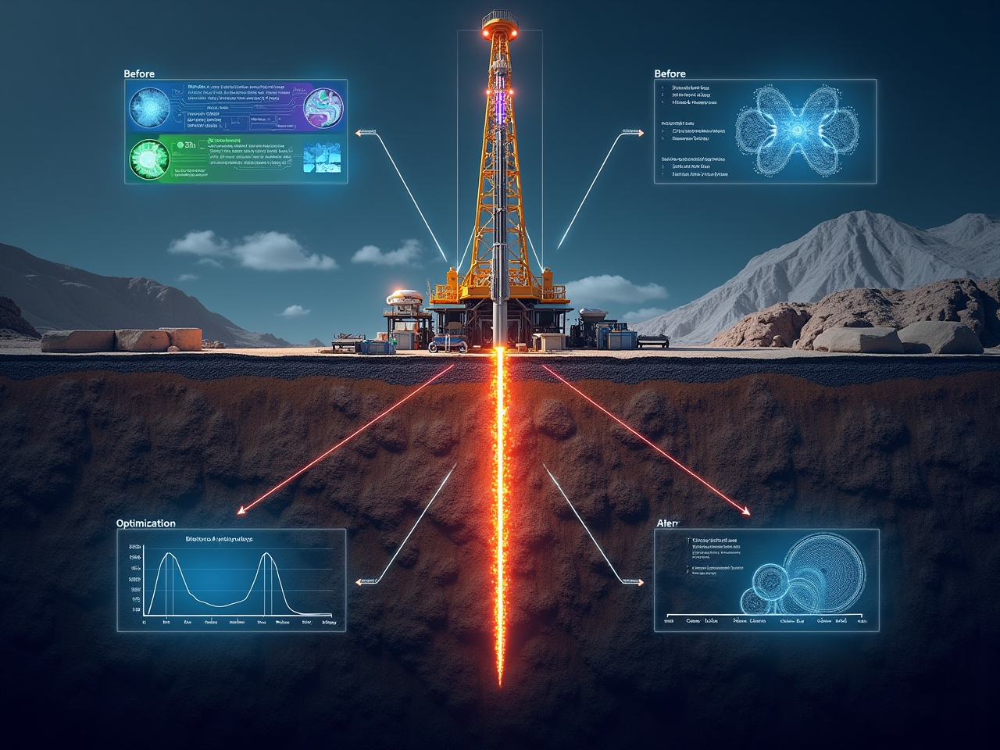
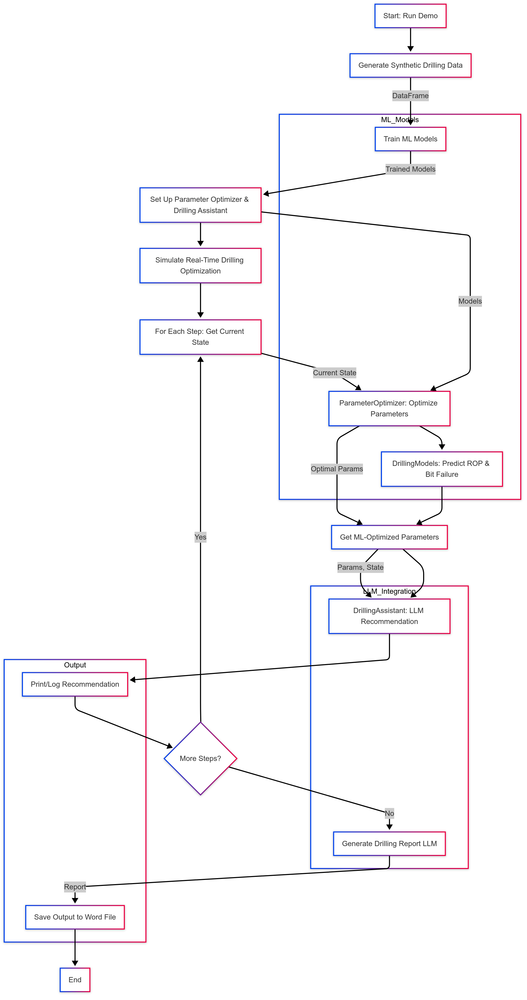

<div align="center">
  
  
  <h1 align="center"><strong>⚙️ DrillGPT: AI-Driven Drilling Optimization Assistant</strong></h1>
  <h4 align="center">LLM-powered multi-agent system for drilling parameter optimization and operational insight</h4>

  <br/>
  
  
  
  
  
  
  
  
</div>

---

## 🛢️ Overview

**DrillGPT** is an AI-powered assistant designed for petroleum engineers to optimize drilling operations using a combination of machine learning, large language models (LLMs), and engineering heuristics. It provides actionable recommendations, interprets drilling data, and automates reporting—empowering engineers to make data-driven decisions in real time.

**Technical Benefits for Petroleum AI Engineers:**
- **Data-Driven Optimization:** Predicts Rate of Penetration (ROP) and bit failure probability using robust ML models.
- **Actionable Insights:** LLM-powered assistant explains recommendations in engineering context.
- **Scenario Analysis:** Synthetic data generation for rapid prototyping and what-if analysis.
- **Automated Documentation:** Generates comprehensive Word reports for operational traceability.
- **Risk-Aware Decision Support:** Optimizes parameters with safety constraints (e.g., bit failure risk).

---

## 📚 Table of Contents
- [Overview](#overview)
- [Architecture & Diagrams](#architecture--diagrams)
- [Key Features](#key-features)
- [Technology Stack](#technology-stack)
- [Installation & Setup](#installation--setup)
- [Usage](#usage)
- [Example Outputs](#example-outputs)
- [Contributions](#contributions)
- [License](#license)
- [Contact](#contact)

---

## 🏗️ Architecture & Diagrams

### Component Diagram


*Shows the modular structure: Data Generation, ML Models, Optimizer, LLM Assistant, and Reporting.*

### Sequence Diagram


*Illustrates the workflow from data input, through ML/LLM processing, to output generation.*

### Flow Diagram


*Visualizes the end-to-end flow: data → ML models → optimization → LLM assistant → report.*

---

## ✨ Key Features

- **Synthetic Drilling Data Generation:** Realistic, parameterized datasets for ML training/testing.
- **ML Models:**
  - ROP prediction (Random Forest regression)
  - Bit failure probability (Random Forest classification)
- **Parameter Optimization:**
  - Grid search for optimal Weight on Bit (WOB), Rotary Speed (RPM), and Flow Rate
  - Risk-aware: maximizes ROP while constraining bit failure probability
- **LLM-Powered Assistant:**
  - Interprets drilling data and optimization results
  - Provides actionable, engineering-context recommendations
  - Generates comprehensive daily drilling reports
- **Automated Reporting:**
  - Exports results and recommendations to Word documents
- **CLI & Scriptable Demo:**
  - End-to-end workflow via `scripts/run_demo.py`
- **Modular, Extensible Codebase:**
  - Easy to adapt for new ML models, data sources, or LLM providers

---

## 🛠️ Technology Stack

| Component         | Technology         |
|-------------------|-------------------|
| Language          | Python 3.8+        |
| ML                | scikit-learn      |
| Data Handling     | pandas, numpy     |
| Visualization     | matplotlib        |
| LLM Integration   | OpenAI API        |
| CLI/UX            | colorama, pyfiglet|
| Reporting         | python-docx       |
| Utilities         | requests          |

---

## 🚀 Installation & Setup

### Prerequisites
- Python 3.8+
- **OpenAI API key** (required for LLM features; must be set as an environment variable)

### Steps
```bash
# Clone the repository
 git clone <repo-url>
 cd drilling_opt

# Create and activate a virtual environment
 python -m venv venv
 source venv/bin/activate  # or venv\Scripts\activate on Windows

# Install dependencies
 pip install -r requirements.txt

# Set your OpenAI API key as an environment variable (required for LLM features)
# On Linux/Mac:
 export OPENAI_API_KEY=your-key
# On Windows:
 set OPENAI_API_KEY=your-key
```

- For LLM features, ensure your OpenAI API key is set in your environment variables as shown above.

---

## 🧑‍💻 Usage

### Run Demo
```bash
python scripts/run_demo.py
```
- Generates synthetic data, trains models, runs optimization, and produces a Word report in `reports/drilling_demo_output.docx`.

### Main Functionalities
- **Synthetic Data Generation:**
  - `drilling/data.py` – Realistic drilling scenarios for ML training/testing.
- **ML Model Training:**
  - `drilling/models.py` – ROP regression, bit failure classification.
- **Parameter Optimization:**
  - `drilling/optimizer.py` – Grid search for optimal WOB, RPM, Flow Rate.
- **LLM Assistant:**
  - `drilling/assistant.py` + `drilling/llm.py` – Interprets data, explains results, generates reports.
- **Reporting:**
  - `drilling/report.py` – Markdown/Word export.

---

## 📊 Example Outputs

- Example report: [`reports/drilling_demo_output.docx`](reports/drilling_demo_output.docx)
- Example CLI output:

```
1. Generating synthetic drilling data...
   Generated 500 data points
2. Training ML models...
3. Setting up parameter optimizer and drilling assistant...
4. Simulating real-time drilling optimization...
--- Step 1/3 ---
Depth: 1234.5 ft, Formation: Sandstone
Current ROP: 45.2 ft/hr
...
Recommendation:
- Increase WOB from 18.5 to 22.0 kips
- Decrease RPM from 150 to 130
...
```

- Sample Output Screenshot:


### 📽️ Demo Video

<video src="artifacts/demo.mp4" controls width="700">Your browser does not support the video tag.</video>

---

## 🤝 Contributions
Contributions are welcome! Please open issues or submit pull requests for improvements, new features, or bug fixes.

---

## ⚖️ License
This project is licensed under the **Apache-2.0 License**. See the [LICENSE](LICENSE) file for details.

---

## 📬 Contact
For questions or collaboration, reach out to:

- **Jaiyesh Chahar**
- [LinkedIn](https://www.linkedin.com/in/jaiyesh-chahar-9b3642107/)
- [GitHub](https://github.com/jaiyesh)

---

## 📝 Citation
If you use DrillGPT in your research or work, please cite:

```
@misc{Chahar2025,
  Author = {Jaiyesh Chahar},
  Title = {DrillGPT: AI-Driven Drilling Optimization Assistant},
  Year = {2025},
  Publisher = {GitHub},
  Journal = {GitHub repository},
  Howpublished = {\url{https://github.com/jaiyesh/drilling_opt}}
}
```

---

## ☕ Support
If you like this project and want to support its development, you can
<a href="https://buymeacoffee.com/jaiyeshchahar" target="_blank"></a>

<p align="right">
 <a href="#top"><b>🔝 Return </b></a>
</p> 